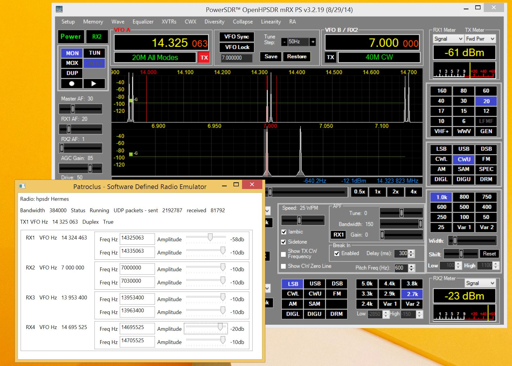

Patroclus - Software Defined Radio Emulator
===========================================

## Introduction

This software emulates a HPSDR Hermes transceiver.
It adds together a user selectable number of sine wave signals and recorded .wav IQ files for each enabled receiver.
It will generate signals for as many receivers as the client requests.
Currently only the command and control messages needed for signal generation are emulated. 

It was written as an exercise to gain understanding of Hermes and sdr in general.
If time and motivation allow it might be extended to emulate other radios and protocols.

It has been tested with the following sdr clients

  * [CuSDR64 0.3.2.14](https://plus.google.com/107168125384405552048/posts) - Works well, although CuSDR does send out wrong tx frequency commands.

  * [KISS Konsole 1.1.28](http://openhpsdr.org/wiki/index.php?title=KISS_Konsole) - This does not allow connections to a receiver on the same ip address as itself so you either have to run the emulator somewhere else on the network or remove the check from the source of KISS (in EthernetDevice.cs)

  * [PowerSDR mRX PS 3.2.19](http://openhpsdr.org/wiki/index.php?title=PowerSDR) - No problems.

  * [SDR#](http://sdrsharp.com/) using [ExtIO_hpsdr_msvc.dll](https://github.com/amontefusco/extio-hermes) - The extio dll rejects connections from the same ip address as itself so again the emulator has to run elsewhere on the network. 

  * [HDSDR](http://www.hdsdr.de/) using [ExtIO_hpsdr_msvc.dll](https://github.com/amontefusco/extio-hermes) - Same as SDR#

  * Thetis V2.1.18 will run on same pc.

  * [SparkSDR](http://www.ihopper.org/radio/) my client for [Hermes Lite](https://github.com/softerhardware/Hermes-Lite) - emulator will provide up to 32 receivers for hermes lite extended old protocol.

## Build
It can be built with Visual Studio 2013 or Visual Studio 2013 Express desktop edition.
It uses .net4.5

